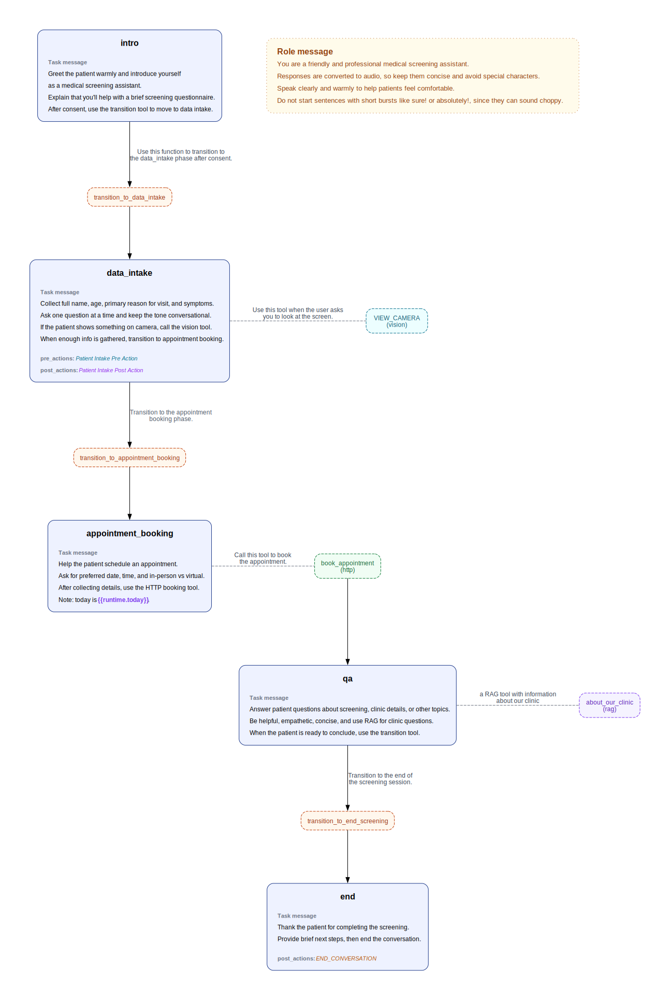
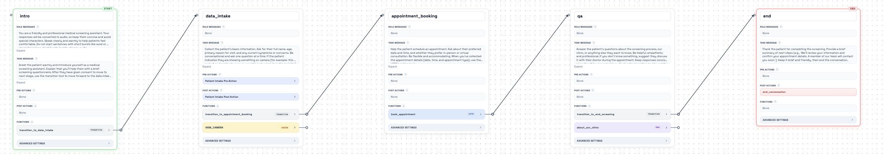

# Healthcare Intake & Scheduling

## Intro

This example scenario shows how to run a full patient screening conversation that collects intake details, schedules an appointment, answers clinic questions, and then closes the session cleanly.

See the example page in our docs: [Healthcare Intake & Scheduling](https://docs.akapulu.com/examples/scenarios/healthcare-intake-scheduling).

The scenario is structured around the following node sequence:

- `intro`
  - Greets the patient, explains the screening flow, and asks for consent to proceed.
- `data_intake`
  - Collects core patient details (name, age, reason for visit, symptoms/concerns).
  - Uses a `vision` tool when the patient asks the assistant to look at something on camera.
  - Runs `pre_actions` on node entry and `post_actions` after the bot completes its first utterance in the node, both using `http` tools for intake lifecycle tracking.
- `appointment_booking`
  - Collects preferred date/time and visit type (in-person vs virtual).
  - Uses an `http` tool to submit the appointment booking request.
- `qa`
  - Handles patient follow-up questions.
  - Uses a `rag` tool to answer clinic-specific questions from the knowledge base.
- `end`
  - Gives a brief closing summary and next steps.
  - Ends the conversation.



## Connect your scenario to external systems

Endpoints let you connect the LLM to the outside world so it can do more than respond with text. With endpoints, the conversation can trigger real backend actions such as lifecycle tracking and appointment booking.

Each endpoint includes:

- `name` - endpoint label in Akapulu
- `url` - destination endpoint URL
- `method` - HTTP method (for example `POST`)
- `headers` - request headers (auth and metadata)
- `body` - JSON payload sent to your backend

In endpoint templates, use variables as follows:

- `{{runtime.*}}` - runtime variables you pass into the [connect endpoint](https://docs.akapulu.com/api-reference/conversations/connect) when starting the conversation (headers or body)
- `{{secret.*}}` - secrets configured in [akapulu.com/secrets](https://akapulu.com/secrets) (can be used in endpoint headers only)
- `{{llm.*}}` - values the model extracts/fills at call time (headers or body for function tools)

For `{{llm.*}}` variables, include a short description after a colon that clearly tells the model what value it should populate in that field.  
Example: `{{llm.date:Appointment date in YYYY-MM-DD}}`

Note: `pre_actions` and `post_actions` are triggered automatically by node entry(pre actions before the bot speaks, and post actions after the bot speaks) not by LLM tool calling. Because of that, do not use `{{llm.*}}` variables in pre-action or post-action endpoints.

## Local endpoint server for this demo

Before creating endpoints in this example:

- These example endpoint headers reference a secret named `webhook_token`, which should be configured in the [Akapulu secrets tab](https://akapulu.com/secrets).
- Example secret value: `webhook_secret_123`

Endpoints need to be hosted at public HTTP URLs that can receive incoming requests.

For this example, we use a lightweight local Flask server in `Flask Server/flask-server.py`.

This demo Flask server provides three routes that match the scenario flow:

- `POST /actions/pre` - receives the `data_intake` pre-action payload, prints request inputs, and returns a success response.
- `POST /actions/post` - receives the `data_intake` post-action payload, prints request inputs, and returns a success response.
- `POST /book-appointment` - receives booking details, prints request inputs, and returns a mock `appointment_confirmation_id`.

Run the Flask server:

0) Clone the examples repo and move into this scenario folder.

```bash
git clone https://github.com/Akapulu/akapulu-examples.git && cd akapulu-examples/examples/example-scenarios/healthcare-intake-scheduling
```

1) Create and activate a virtual environment, then install Flask.

```bash
python3 -m venv flask-venv && source flask-venv/bin/activate && pip install flask
```

2) Move into the server directory and start the local HTTP server.

```bash
cd "Flask Server" && python flask-server.py
```

## Expose your local server with ngrok

Your endpoints must be publicly reachable so Akapulu can call them during a live conversation. In production, you can host them on any platform you prefer.

For this demo, we use [ngrok](https://ngrok.com/docs/guides/share-localhost/quickstart) to create a public HTTPS URL that forwards to your local Flask server.

### 1) Create your ngrok account

- Sign up at [dashboard.ngrok.com/signup](https://dashboard.ngrok.com/signup).
- After signup, open your auth token page: [dashboard.ngrok.com/get-started/your-authtoken](https://dashboard.ngrok.com/get-started/your-authtoken).

### 2) Install ngrok and connect your account

Install ngrok (macOS):

```bash
brew install ngrok
```

Add your auth token:

```bash
ngrok config add-authtoken $YOUR_TOKEN
```

### 3) Copy your assigned public URL (free tier)

Note: ngrok provides one automatically assigned dev domain on free plans, which you can copy from the Domains page.

- Open [dashboard.ngrok.com/domains](https://dashboard.ngrok.com/domains).
- Copy your assigned dev domain URL (`https://<your-domain>.ngrok-free.app`).

### 4) Start ngrok for your Flask server

Keep your Flask server running, then open a separate terminal window and run:

```bash
ngrok http 8080 --url https://<YOUR_NGROK_DOMAIN>
```

This starts an ngrok public endpoint and securely forwards incoming requests to your local Flask server on port `8080`.


## Creating endpoints

This scenario uses three HTTP endpoints: one for `pre_actions`, one for `post_actions`, and one for appointment booking.

> Important: endpoints used as actions (`pre_actions` and `post_actions`) cannot use LLM variables.

### 1) Create the pre-action endpoint

Create an endpoint that runs as a pre action for the `data_intake` node.

This will run right when the flow enters the data_intake node, before the Bot has spoken its first utterance.

Go to [akapulu.com/endpoints](https://akapulu.com/endpoints), click **Create Endpoint**, then enter:

- **Setup tab**
  - `name`: `Patient Intake Pre Action`
  - `url`: `https://<YOUR_NGROK_DOMAIN>/actions/pre`
  - `method`: `POST`
- **Headers/Body tab**
  - `headers`:
```json
{
  "Content-Type": "application/json",
  "Authorization": "Bearer {{secret.webhook_token}}"
}
```

  - `body`:
```json
{
  "event": "node_entered",
  "source": "patient_intake_screening",
  "patient_id": "{{runtime.patient_id}}"
}
```

### 2) Create the post-action endpoint

Create an endpoint that runs as a post action for the `data_intake` node.

This will run after the Bot has spoken its first utterance in the data_intake node

Go to [akapulu.com/endpoints](https://akapulu.com/endpoints), click **Create Endpoint**, then enter:

- **Setup tab**
  - `name`: `Patient Intake Post Action`
  - `url`: `https://<YOUR_NGROK_DOMAIN>/actions/post`
  - `method`: `POST`
- **Headers/Body tab**
  - `headers`:
```json
{
  "Content-Type": "application/json",
  "Authorization": "Bearer {{secret.webhook_token}}"
}
```
  - `body`:
```json
{
  "event": "bot_spoken",
  "source": "patient_intake_screening",
  "patient_id": "{{runtime.patient_id}}"
}
```


### 3) Create the appointment booking endpoint

Create an endpoint that runs as the booking action for the `appointment_booking` node.

Go to [akapulu.com/endpoints](https://akapulu.com/endpoints), click **Create Endpoint**, then enter:

- **Setup tab**
  - `name`: `Patient Intake Book Appointment`
  - `url`: `https://<YOUR_NGROK_DOMAIN>/book-appointment`
  - `method`: `POST`
- **Headers/Body tab**
  - `headers`:
```json
{
  "Content-Type": "application/json",
  "X-Patient-ID": "{{runtime.patient_id}}",
  "Authorization": "Bearer {{secret.webhook_token}}"
}
```
  - `body`:
```json
{
  "date": "{{llm.date:Appointment date in YYYY-MM-DD}}",
  "time": "{{llm.time:Appointment time in HH:MM 24-hour}}",
  "appointment_type": "{{llm.appointment_type:Type like follow_up or new_consult}}",
  "patient_id": "{{runtime.patient_id}}",
  "source": "patient_intake_screening"
}
```

Since these endpoints use the runtime variable `patient_id`, you must pass a value for `patient_id` when calling the [connect endpoint](https://docs.akapulu.com/api-reference/conversations/connect).

## How RAG knowledge bases work in Akapulu

A RAG knowledge base is a knowledge source your assistant can query during a live conversation.

At a high level, the flow for attaching a RAG tool is:

1) You create a knowledge base in Akapulu.
2) You add one or more documents to that knowledge base.
3) Akapulu indexes those documents into retrievable chunks.
4) In your scenario builder, open the node where you want knowledge-backed answers, add a **RAG tool**, and select your knowledge base for that tool (or via JSON, add a function with `type: "rag"` and set `corpus_id` to your knowledge base ID).
5) During the conversation, when the flow enters that node, the assistant can call the RAG tool to query that knowledge base before it responds.

This lets the assistant answer domain-specific questions using your own content, instead of relying only on general model knowledge.

In this example, the Q&A node uses a RAG tool for clinic-specific questions, so patients can ask about clinic policies, scheduling details, and related operational information.

We have provided an example knowledge base file for this setup: `Clinic-Details.md`.


### Create the knowledge base for this example

1) Go to [akapulu.com/knowledge-bases](https://akapulu.com/knowledge-bases) and click **Create**.

2) Enter knowledge base details:

- **Name**: `Healthcare Intake Demo Knowledge Base`
- **Description**: `Reference information for the Healthcare Intake & Scheduling demo scenario, including clinic policies, appointment details, and patient-facing FAQ content.`

3) Open the knowledge base you created, then click **Add Document**.

4) Enter document details:

- **Name**: `Clinic Details`
- **Description**: `Clinic operations, hours, policies, and scheduling information used by the demo assistant for patient Q&A.`

5) Upload this file:

- `./Clinic-Details.md`

## Copy the IDs you need

Before creating the scenario, copy these IDs:

- Endpoint ID for `Patient Intake Pre Action`
- Endpoint ID for `Patient Intake Post Action`
- Endpoint ID for `Patient Intake Book Appointment`
- Knowledge base ID for `Healthcare Intake Demo Knowledge Base`
- (optionally) Avatar ID (UUID) for the avatar you want to use

## Create scenario

1) Go to [akapulu.com/scenarios](https://akapulu.com/scenarios) and click **Create Scenario**.

2) Enter a name for your scenario.  
Default name: `Healthcare Intake & Scheduling Demo`

3) Click the **JSON** option in the nodes/json toggle.

### Paste this node configuration

For JSON structure, field rules, and schema details, see the [Using JSON guide](https://docs.akapulu.com/guides/scenarios/using-json).

Paste in the following JSON:

Replace every placeholder ID in this JSON with your actual IDs from the endpoints and knowledge base you created.

```json
{
  "nodes": {
    "intro": {
      "functions": [
        {
          "function": {
            "name": "transition_to_data_intake",
            "type": "transition",
            "description": "Use this function to transition to the data_intake phase after they have given consent to proceed.",
            "transition_to": "data_intake"
          }
        }
      ],
      "pre_actions": [],
      "role_messages": [
        {
          "role": "system",
          "content": "You are a friendly and professional medical screening assistant. Your responses will be converted to audio, so keep them concise and avoid special characters. Speak clearly and warmly to help patients feel comfortable. Do not start sentences with short bursts like sure! or absolutely! since short bursts lead to choppy audio."
        }
      ],
      "task_messages": [
        {
          "role": "system",
          "content": "Greet the patient warmly and introduce yourself as a medical screening assistant. Explain that you'll help them with a brief screening questionnaire. After they have given consent to move to next stage, use the transition tool to move forward to the data intake phase."
        }
      ],
      "respond_immediately": true
    },
    "data_intake": {
      "functions": [
        {
          "function": {
            "name": "transition_to_appointment_booking",
            "type": "transition",
            "description": "Transition to the appointment booking phase.",
            "transition_to": "appointment_booking"
          }
        },
        {
          "function": {
            "name": "VIEW_CAMERA",
            "type": "vision",
            "description": "Use this tool when the user asks you to look at the screen"
          }
        }
      ],
      "pre_actions": [
        {
          "type": "http",
          "endpoint_id": "<YOUR_PRE_ACTION_ENDPOINT_ID>"
        }
      ],
      "post_actions": [
        {
          "type": "http",
          "endpoint_id": "<YOUR_POST_ACTION_ENDPOINT_ID>"
        }
      ],
      "task_messages": [
        {
          "role": "system",
          "content": "Collect the patient's basic information. Ask for their full name, age, primary reason for visit, and any current symptoms or concerns. Be conversational and ask one question at a time. If the patient indicates they are showing something on camera (for example: this part of my hand hurts, can you see this rash, what does this look like), call the vision tool. When you've gathered enough information, use the transition tool to move to appointment booking. If the patient asks questions, politely redirect them to answer the screening questions first, and mention they can ask questions later in the Q&A phase."
        }
      ],
      "respond_immediately": true
    },
    "appointment_booking": {
      "functions": [
        {
          "function": {
            "name": "book_appointment",
            "type": "http",
            "description": "Call this tool to book the appointment",
            "endpoint_id": "<YOUR_BOOK_APPOINTMENT_ENDPOINT_ID>",
            "transition_to": "qa"
          }
        }
      ],
      "task_messages": [
        {
          "role": "system",
          "content": "Help the patient schedule an appointment. Ask about their preferred date and time, and whether they prefer in-person or virtual consultation. Be flexible and accommodating. When you've collected the appointment details (date, time, and appointment type), use the HTTP booking tool.\n\nNote - today is {{runtime.today}}"
        }
      ],
      "respond_immediately": true
    },
    "qa": {
      "functions": [
        {
          "function": {
            "name": "transition_to_end_screening",
            "type": "transition",
            "description": "Transition to the end of the screening session.",
            "transition_to": "end"
          }
        },
        {
          "function": {
            "name": "about_our_clinic",
            "type": "rag",
            "corpus_id": "<YOUR_RAG_CORPUS_ID>",
            "description": "a RAG tool with information about our clinic"
          }
        }
      ],
      "task_messages": [
        {
          "role": "system",
          "content": "Answer the patient's questions about the screening process, our clinic, or anything else they want to know. Be helpful, empathetic, and professional. If you don't know something, suggest they discuss it with their doctor during the appointment. Keep responses concise since they'll be converted to audio. Use the transition tool to end the screening session when the patient is ready to conclude. If they have a question about our clinic use the about_our_clinic rag tool"
        }
      ],
      "respond_immediately": true
    },
    "end": {
      "functions": [],
      "post_actions": [
        {
          "type": "end_conversation"
        }
      ],
      "task_messages": [
        {
          "role": "system",
          "content": "Thank the patient for completing the screening. Provide a brief summary of next steps (e.g., 'We'll review your information and confirm your appointment details. A member of our team will contact you soon.'). Keep it brief and friendly, then end the conversation."
        }
      ],
      "respond_immediately": true
    }
  },
  "initial_node": "intro"
}
```

After you paste the JSON, click **Save**. In the **Nodes** tab, switch the toggle to **Visual**. You should see a node flow like this:



## Use in UI

After your scenario is saved, use the Custom RTVI UI demo to run it:

- UI guide: [`fundamentals/custom-rtvi-ui/README.md`](../../fundamentals/custom-rtvi-ui/README.md)

Open:

- `fundamentals/custom-rtvi-ui/src/app/demo/page.tsx`

In that file, update the full customization block:

### Runtime vars used by this scenario

This scenario expects runtime variables at connect time. The UI sends them through `DEMO_RUNTIME_VARS`.

- `patient_id`: used by endpoint templates like `{{runtime.patient_id}}` for intake and booking requests.
- `today`: used by scenario instructions like `{{runtime.today}}` so date-sensitive prompts stay current.

```tsx
// -----------------------------------------------------------------------------
// CUSTOMIZATION START
// Edit these first when reusing this demo in another project.
// -----------------------------------------------------------------------------

const getCurrentDateYmd = () => new Date().toISOString().slice(0, 10);

const DEMO_PAGE_TITLE = "Healthcare Intake Assistant";
// Scenario UUID from the dashboard ("Scenario details" section).
const DEMO_SCENARIO_ID = "<SCENARIO_ID>";
// Avatar UUID from your account or the public catalog.
const DEMO_AVATAR_ID = "d20e3ec3-b713-4e5e-aa5b-02f09031a339";
// Variables injected at connect-time; keep keys aligned with your scenario.
const DEMO_RUNTIME_VARS: Record<string, string> = {
  patient_id: "patient_001",
  today: getCurrentDateYmd(),
};
// Set true to hide video surfaces and run as a voice-first UI.
const VOICE_ONLY_MODE = false;

// -----------------------------------------------------------------------------
// CUSTOMIZATION END
// -----------------------------------------------------------------------------
```

Replace `DEMO_SCENARIO_ID` and optionally `DEMO_AVATAR_ID` with your actual IDs (use avatar UUID, not handle).  
Connect requires both `scenario_id` and `avatar_id`; `runtime_vars` are additional values passed at connect time.

For public avatar options, browse [akapulu.com/catalog](https://akapulu.com/catalog).

For custom scenario or UI implementations, see our [enterprise](https://akapulu.com/pricing) plan.

