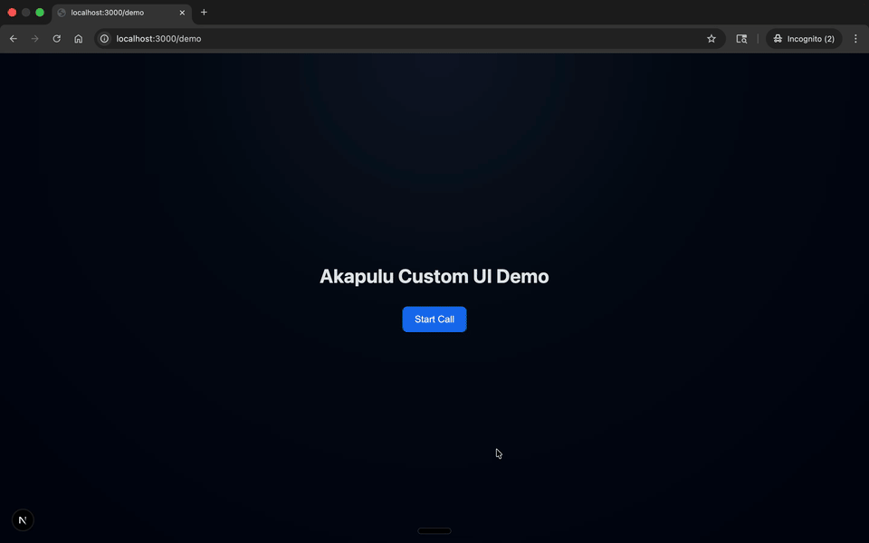
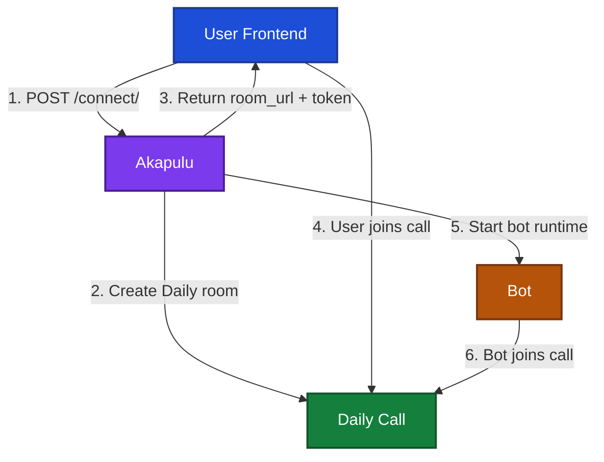
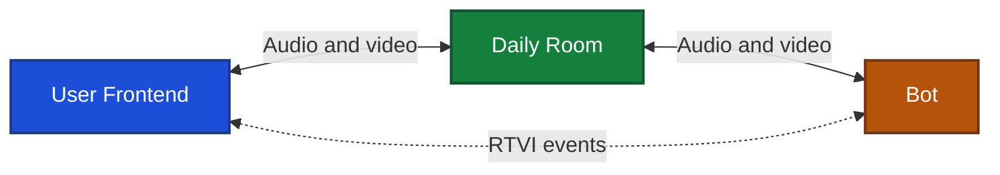

# Custom UI (Next.js)

This example shows how to build a custom frontend UI for Akapulu conversations using Next.js + [RTVI](https://docs.pipecat.ai/client/js/introduction).

Instead of relying on a default call surface, you control the full experience: call controls, recording triggers, and how realtime events are presented in your app. This includes RTVI events such as transcripts, function/tool calls, and flow node transitions.

## Quick Start

1. Log in to Akapulu and create a scenario.
   - See [Simple Assistant guide](../simple-assistant/README.md#prerequisite-create-a-scenario).
2. Create an API key and add it to your environment.
   - See [Simple Assistant run section](../simple-assistant/README.md#run-the-simple-assistant).
3. Create `.env.local` from `.env.example` and set your API key.

```bash
cp .env.example .env.local
```

Then edit `.env.local`:

```env
AKAPULU_API_KEY=your_api_key_here
```

4. Update `src/app/demo/page.tsx` with your scenario ID.

```typescript
// src/app/demo/page.tsx lines 51 to 58
const DEMO_PAGE_TITLE = "Akapulu Custom UI Demo";
// Scenario UUID from the dashboard ("Scenario details" section).
const DEMO_SCENARIO_ID = "<SCENARIO_ID>";
// Variables injected at connect-time; keep keys aligned with your scenario.
const DEMO_RUNTIME_VARS: Record<string, string> = {};
// Set true to hide video surfaces and run as a voice-first UI.
const VOICE_ONLY_MODE = false;
```

Replace `DEMO_SCENARIO_ID` with your scenario UUID.

5. Install dependencies and start the dev server.

```bash
npm install
npm run dev
```

6. Open `http://localhost:3000/demo` and click `Start Call`.



## Architecture overview
### File Structure

```text
.
├── README.md
├── src
│   └── app
│       ├── api
│       │   └── demo
│       │       └── route.ts
│       ├── demo
│       │   ├── Demo.module.css
│       │   └── page.tsx
│       └── page.tsx
```

Main stuff:

- `src/app/demo/page.tsx` - the core custom UI: connect flow, call controls, transcript stream, stage changes, and tool-event toasts.
- `src/app/api/demo/route.ts` - server proxy used by the demo UI for `connect` + `updates` (keeps API key server-side).
- `src/app/demo/Demo.module.css` - all styles for the custom demo surface.
- `src/app/page.tsx` - lightweight entry that points to `/demo`.

Everything else is standard project scaffolding for this Next.js app.

### Akapulu Call Lifecycle

Akapulu conversations start by calling the **Connect API**:

- **Endpoint**: `POST https://akapulu.com/api/conversations/connect/`
- **Auth**: `Authorization: Bearer <AKAPULU_API_KEY>`
- **Input body**:
  - `scenario_id` (required): which Akapulu scenario to run.
  - `runtime_vars` (optional object): runtime values injected into the scenario.
  - `voice_only_mode` (optional boolean): `true` for audio-only, `false` for video-capable mode.
  - `custom_rtvi_connection` (optional boolean): use `true` in this example.

If successful, Akapulu returns:

- `room_url`
- `token`
- `conversation_session_id`

Akapulu uses that request to set everything up: it creates the Daily room and credentials, starts the AI bot, and has the bot join the Daily room.
Your frontend then joins that same room using `room_url` and `token`.
In this example, your app logic runs through the [Pipecat JavaScript client](https://docs.pipecat.ai/client/js/introduction), while [Daily](https://docs.daily.co/get-started) handles media transport underneath through the [Pipecat Daily transport](https://docs.pipecat.ai/client/js/transports/daily).

### Pipecat plus Daily model

Akapulu uses [Daily](https://docs.daily.co/get-started) as the WebRTC provider for media, and this frontend uses [PipecatClient](https://docs.pipecat.ai/client/js/api-reference/client-constructor) as the app level realtime client API.
In practice, Daily carries live audio and video between participants:

- user -> bot (your mic/camera stream)
- bot -> user (the avatar's audio/video stream)

Inside the Daily room there are two core participants:

- **User participant** (the local browser user)
- **AI avatar participant** (the assistant runtime joined as a remote participant)

There are multiple ways to display a Daily call interface:

- Use the room URL directly with [Daily Prebuilt](https://docs.daily.co/prebuilt), like the simple assistant example approach.
- Embed the call URL with a [Daily frame](https://docs.daily.co/reference/daily-js/factory-methods/create-frame).
- Build a fully custom interface with a [Daily call object](https://docs.daily.co/reference/daily-js/factory-methods/create-call-object).

For Akapulu, the recommended method is a custom UI using a [Daily call object](https://docs.daily.co/reference/daily-js/factory-methods/create-call-object) with Pipecat and custom RTVI handling, which is what this example demonstrates.
Use the [transport overview](https://docs.pipecat.ai/client/js/transports/transport) to understand lifecycle states, and the [Daily transport docs](https://docs.pipecat.ai/client/js/transports/daily) for transport-specific behavior.

### Akapulu Call Lifecycle Diagram



### RTVI event model

In this architecture, **[RTVI](https://docs.pipecat.ai/client/js/introduction)** is the real-time event stream for conversation state.
It is separate from media transport. Daily carries audio and video, while Pipecat surfaces RTVI events your UI can react to through [callbacks and events](https://docs.pipecat.ai/client/js/api-reference/callbacks).

Akapulu streams RTVI events to the frontend for things like:

- transcripts
- tool/function events
- flow-node/stage changes



So conceptually:

- **[Pipecat client](https://docs.pipecat.ai/client/js/introduction)** is the app level realtime client API.
- **Daily WebRTC** carries media tracks.
- **[RTVI](https://docs.pipecat.ai/client/js/introduction)** carries conversation events through the Pipecat layer.
- **The frontend UI** renders both into a custom experience.

This Next.js project is an example of that architecture: it shows one way to render a Daily video call UI and consume a custom RTVI event stream in a custom interface.
If you want deeper Daily details, see the [Daily call client docs](https://docs.daily.co/reference/daily-js/daily-call-client) and [participants API docs](https://docs.daily.co/reference/daily-js/instance-methods/participants).


## Code walkthrough `page.tsx` connect skeleton


### 1. Create the client with Daily transport

The page creates one `PipecatClient` instance and wires it to `DailyTransport`.
Your app code talks to `PipecatClient`, while Daily handles the underlying WebRTC media transport.
See [client constructor](https://docs.pipecat.ai/client/js/api-reference/client-constructor) and [Daily transport](https://docs.pipecat.ai/client/js/transports/daily) docs for these two pieces.

```typescript
/*
========================================
src/app/demo/page.tsx
========================================
*/

// Pipecat is the app layer.
// This is the main client object your frontend talks to.
import { PipecatClient } from "@pipecat-ai/client-js";
// Daily is the media layer.
// This transport plugs Daily audio/video into the Pipecat client.
import { DailyTransport } from "@pipecat-ai/daily-transport";

// Keep one shared client instance for this page.
const [client, setClient] = useState<PipecatClient | null>(null);

useEffect(() => {
  const nextClient = new PipecatClient({
    // This is where the two layers connect:
    // Pipecat app layer + Daily media layer.
    transport: new DailyTransport(),
    enableMic: true,
    enableCam: !VOICE_ONLY_MODE,
  });
  // Save the connected client so the rest of the page can use it via the client variable
  setClient(nextClient);
}, []);
```

### 2. Call connect endpoint, then join Daily call

On start, the frontend first calls `/api/demo` to get connection credentials.
After that response returns `room_url` and `token`, it joins the Daily call via `client.connect`.
This `connect` flow is documented in [client methods](https://docs.pipecat.ai/client/js/api-reference/client-methods#connect).

```typescript
/*
========================================
src/app/demo/page.tsx
========================================
*/
function CustomRtviDemo() {

  // Frontend calls our local Next.js API route first.
  const startResponse = await fetch("/api/demo", {
    method: "POST",
    headers: { "Content-Type": "application/json" },
    body: JSON.stringify({
      // These values are passed through to Akapulu connect.
      scenario_id: DEMO_SCENARIO_ID,
      runtime_vars: DEMO_RUNTIME_VARS,
      voice_only_mode: VOICE_ONLY_MODE,
    }),
  });
}
```

And this is the server side route that calls the real Akapulu connect API:

```typescript
/*
========================================
src/app/api/demo/route.ts
========================================
*/

// Here we call the Akapulu /connect endpoint, Step 1 in the Akapulu Call Lifecycle Diagram
const response = await fetch(`${AKAPULU_API_BASE_URL}/conversations/connect/`, {
  method: "POST",
  headers: {
    // API key stays server side in this route.
    Authorization: `Bearer ${apiKey}`,
    "Content-Type": "application/json",
  },
  body: JSON.stringify({
    scenario_id: scenarioId,
    runtime_vars: body?.runtime_vars,
    voice_only_mode: body?.voice_only_mode === true,
    custom_rtvi_connection: true,
  }),
});
//Akapulu will create the daily room (Step 2 in the Akapulu Call Lifecycle Diagram)
```

Then the frontend uses the route response to join the call:

```typescript
/*
========================================
src/app/demo/page.tsx
========================================
*/
function CustomRtviDemo() {


  // Frontend receives room credentials from the API route response.
  // startData contains the room_url and token, returned by the Akapulu /connect endpoint (Step 3 in the Akapulu Call Lifecycle Diagram)
  const startData = await startResponse.json();

  // Pipecat joins the Daily call using room_url and token. (Step 4 in the Akapulu Call Lifecycle Diagram)
  await client.connect({
    room_url: startData.room_url,
    token: startData.token,
  } as any);
}
```

### 3. Provider layering for Daily call state plus RTVI integration

`PipecatClientProvider` is the top level provider.
This is the core wiring that allows the same page to use Daily call state and RTVI connected client state together.
For event handling patterns, see [callbacks and events](https://docs.pipecat.ai/client/js/api-reference/callbacks).

```typescript
/*
========================================
src/app/demo/page.tsx
========================================
*/
import { PipecatClientProvider, PipecatClientAudio } from "@pipecat-ai/client-react";
import { DailyProvider } from "@daily-co/daily-react";
import { DailyTransport } from "@pipecat-ai/daily-transport";

// Read the transport instance from the shared Pipecat client.
const dailyTransport = client.transport as DailyTransport;

// Pipecat provider exposes app-level realtime client state.
<PipecatClientProvider client={client}>
  // Daily provider exposes media and participant state from the Daily call object.
  <DailyProvider callObject={dailyTransport.dailyCallClient}>
    // Your UI component that consumes both Pipecat and Daily context.
    // CustomRtviDemo can use usePipecatClient() and useDaily() because of the providers above ^.
    <CustomRtviDemo /> 
  </DailyProvider>
  // Audio output element for assistant voice playback.
  <PipecatClientAudio />
</PipecatClientProvider>
```

### 4. What `CustomRtviDemo` can access inside these providers

Because `CustomRtviDemo` is wrapped in both providers, it can read both conversation state and media state.

- From `PipecatClientProvider client={client}`
  - Access the shared Pipecat client with `usePipecatClient()`
  - Call [client methods](https://docs.pipecat.ai/client/js/api-reference/client-methods) like `connect`, `disconnect`, and event subscriptions
  - Handle RTVI events from [callbacks and events](https://docs.pipecat.ai/client/js/api-reference/callbacks), such as transcripts and server messages

```typescript
/*
========================================
src/app/demo/page.tsx
========================================
*/
import { usePipecatClient } from "@pipecat-ai/client-react";

function CustomRtviDemo() {
  // Comes from PipecatClientProvider
  const client = usePipecatClient();

  const startCall = async () => {
    // Same connect call shown above.
    // It uses the room_url and token returned by the /connect endpoint.
    await client.connect({ room_url: "...", token: "..." });
  };
}
```

- From `DailyProvider callObject={dailyTransport.dailyCallClient}`
  - Access Daily call state with `useDaily()`
  - Read participant ids with `useParticipantIds()`
  - Read track state with `useVideoTrack()`
  - Render participant video using `DailyVideo`

```typescript
/*
========================================
src/app/demo/page.tsx
========================================
*/
import { useParticipantIds, DailyVideo, useVideoTrack } from "@daily-co/daily-react";

function CustomRtviDemo() {
  // Comes from DailyProvider
  const participantIds = useParticipantIds({ filter: "remote" });
  const participantId = participantIds[0];
  const videoTrack = useVideoTrack(participantId);

  return <DailyVideo sessionId={participantId} type="video" />;
}
```

In plain terms:
- Pipecat provider gives `CustomRtviDemo` the realtime conversation layer.
- Daily provider gives `CustomRtviDemo` the audio and video media layer.

### 5. RTVIEvent reference

RTVI event names and payload patterns come from [callbacks and events](https://docs.pipecat.ai/client/js/api-reference/callbacks).

`RTVIEvent` is Pipecat's built-in event enum. Pick an event name, register a handler with `client.on`, and remove it with `client.off` in cleanup.

Built-in event objects are accessed directly in each handler:

```typescript
client.on(RTVIEvent.UserTranscript, (transcript: any) => {
  const text = transcript.text;
  const isFinal = transcript.final;
});
```

ServerMessage objects are accessed through the `message` object:

```typescript
client.on(RTVIEvent.ServerMessage, (message: any) => {
  const messageType = message.type;
  const functionName = message.function_name;
  const body = message.body;
});
```

```typescript
/*
========================================
src/app/demo/page.tsx
========================================
*/
import { RTVIEvent } from "@pipecat-ai/client-js";

function CustomRtviDemo() {
  useEffect(() => {
    const handleEvent = (...args: any[]) => {
      console.log("RTVI event received", args);
    };

    // Replace <EVENT_TYPE> with a real event, for example UserTranscript or BotStartedSpeaking.
    client.on(RTVIEvent.<EVENT_TYPE>, handleEvent);
  }, [client]);
}
```

Some built-in Pipecat events:

- `RTVIEvent.UserTranscript`
- `RTVIEvent.BotTranscript`
- `RTVIEvent.UserStartedSpeaking`
- `RTVIEvent.UserStoppedSpeaking`
- `RTVIEvent.BotStartedSpeaking`
- `RTVIEvent.BotStoppedSpeaking`
- etc

#### 5.1 Built-in Pipecat RTVI events

##### Transcript events

- `RTVIEvent.UserTranscript`
- `RTVIEvent.BotTranscript`


```typescript
/*
========================================
src/app/demo/page.tsx
========================================
*/
import { RTVIEvent } from "@pipecat-ai/client-js";

function CustomRtviDemo() {
  useEffect(() => {

    // User transcript payload fields.
    const handleUserTranscript = (transcript: { text?: string; final?: boolean }) => {
      const text = transcript.text || "";
      const isFinal = transcript.final === true;
      // TODO: Update your user transcript UI with `text`.
    };

    // Bot transcript payload fields.
    const handleBotTranscript = (transcript: { text?: string }) => {
      const text = transcript.text || "";
      // TODO: Append `text` to your bot transcript UI.
    };

    // Subscribe.
    client.on(RTVIEvent.UserTranscript, handleUserTranscript);
    client.on(RTVIEvent.BotTranscript, handleBotTranscript);
  }, [client]);
}
```

##### User started speaking event

- `RTVIEvent.UserStartedSpeaking`

#### 5.2 Akapulu custom `ServerMessage` events

```typescript
/*
========================================
src/app/demo/page.tsx
========================================
*/
import { RTVIEvent } from "@pipecat-ai/client-js";

function CustomRtviDemo() {
  useEffect(() => {
    // In backend Pipecat pipelines this typically originates from UserStartedSpeakingFrame.
    // In frontend code you listen to RTVIEvent.UserStartedSpeaking.
    const handleUserStartedSpeaking = () => {
      // TODO: update listening UI state
      console.log("UserStartedSpeaking");
    };

    client.on(RTVIEvent.UserStartedSpeaking, handleUserStartedSpeaking);
  }, [client]);
}
```

```typescript
/*
========================================
src/app/demo/page.tsx
========================================
*/
import { RTVIEvent } from "@pipecat-ai/client-js";

function CustomRtviDemo() {
  useEffect(() => {
    // Runs whenever the server sends an RTVI server-message event.
    const handleServerMessage = (message: any) => {
      // `message.type` tells you what kind of event this is.
      console.log("RTVI message type", message.type);
    };

    // Subscribe to server messages when this component is mounted.
    client.on(RTVIEvent.ServerMessage, handleServerMessage);
  }, [client]);
}
```

##### Event types and payloads

Akapulu sends custom runtime events through `RTVIEvent.ServerMessage`.
In `handleServerMessage(message)`, these are the `message.type` values and `message` payload shapes used in this project:

- `flow-node-changed`
  - `message.type`: `"flow-node-changed"`
  - `message payload`: `{ node: "<new node name>" }`

- `bot-speaking-state`
  - `message.type`: `"bot-speaking-state"`
  - `message payload`: `{ state: "speaking" | "idle" }`

- `RAG`
  - `message.type`: `"RAG"`
  - `message payload`: `{ function_name: "<function name>", body: { query: "<RAG query>" } }`

- `vision`
  - `message.type`: `"vision"`
  - `message payload`: `{ function_name: "<function name>"}`

- `http`
  - `message.type`: `"http"`
  - `message payload`: `{ function_name: "<function name>", body: {<...args>} }`

- `call_timeout`
  - `message.type`: `"call_timeout"`
  - `message payload`: `{ reason: "<reason>" }`


##### Stage transition events

Stage transitions come through `RTVIEvent.ServerMessage` with `message.type === "flow-node-changed"`.
This message channel maps to [custom messaging](https://docs.pipecat.ai/client/js/api-reference/messages).

```typescript
/*
========================================
src/app/demo/page.tsx
========================================
*/
import { RTVIEvent } from "@pipecat-ai/client-js";

function CustomRtviDemo() {
  useEffect(() => {

    const handleServerMessage = (message: any) => {
      if (message?.type === "flow-node-changed") {
        const nextNode = message?.node || null;

        // TODO: update your stage in the UI
      }
    };

    client.on(RTVIEvent.ServerMessage, handleServerMessage);
  }, [client]);
}
```

##### Bot speaking state

Bot speaking state comes through `RTVIEvent.ServerMessage`.
The speech activity events are documented in [callbacks and events](https://docs.pipecat.ai/client/js/api-reference/callbacks).

```typescript
/*
========================================
src/app/demo/page.tsx
========================================
*/
import { RTVIEvent } from "@pipecat-ai/client-js";

function CustomRtviDemo() {
  useEffect(() => {

    const handleServerMessage = (message: any) => {
      if (message?.type === "bot-speaking-state") {
        // Access the bot speaking state from payload.
        // Current values are "speaking" and "idle".
        const speakingState = message?.state;
        const isBotSpeaking = speakingState === "speaking";

        // TODO: update speaking indicator UI with isBotSpeaking
      }
    };

    client.on(RTVIEvent.ServerMessage, handleServerMessage);
  }, [client]);
}
```

##### Tool call events

Tool calls come in through `RTVIEvent.ServerMessage`.
Here is the minimal pattern for `RAG`, `vision`, and `http`:
For server message structure and patterns, see [custom messaging](https://docs.pipecat.ai/client/js/api-reference/messages).

```typescript
/*
========================================
src/app/demo/page.tsx
========================================
*/
import { RTVIEvent } from "@pipecat-ai/client-js";

function CustomRtviDemo() {
  useEffect(() => {

    const handleServerMessage = (message: any) => {
      // message.type can be:
      // RAG | vision | http 
      const messageType = message?.type;
      // message.function_name is the tool function name
      const functionName = message?.function_name;
      // message.body examples:
      // RAG -> { query: "..." }
      // vision -> {}
      // http -> { ...tool args... }
      const body = message?.body;

      if (messageType === "RAG") {
        // TODO: handle RAG tool call payload
        return;
      }

      if (messageType === "vision") {
        // TODO: handle vision tool call payload
        return;
      }

      if (messageType === "http") {
        // TODO: handle http tool call payload
        return;
      }
    };

    client.on(RTVIEvent.ServerMessage, handleServerMessage);
  }, [client]);
}
```


### 6. Startup readiness and loading UX

The bot can take around 10 to 15 seconds to fully initialize and become ready.
Show a loading UI during this period.

Updates endpoint:

- `GET https://akapulu.com/api/conversations/<conversation_session_id>/updates/`
- Output fields:
  - `call_is_ready`: boolean flag that the call is ready to enter connected UI
  - `completion_percent`: numeric progress value for loading progress UI
  - `latest_update_text`: current human-readable setup status message

```typescript
/*
========================================
src/app/demo/page.tsx
========================================
*/
async function waitForCallReady(conversationSessionId: string) {
  while (true) {

    // Call the Akapulu updates endpoint.
    const response = await fetch(
      `https://akapulu.com/api/conversations/${conversationSessionId}/updates/`,
      {
        headers: {
          Authorization: `Bearer ${AKAPULU_API_KEY}`,
        },
      },
    );
    // Parse the endpoint payload.
    const payload = await response.json();

    const callIsReady = payload.call_is_ready === true;
    const completionPercent = payload.completion_percent;
    const latestUpdateText = payload.latest_update_text;

    // TODO update your progress bar with completionPercent
    // TODO update your loading text with latestUpdateText
    if (callIsReady) {
      // TODO switch UI from loading to connected
      break;
    }

    await new Promise((resolve) => setTimeout(resolve, 200));
  }
}
```

Note: in this demo app, the frontend calls the intermediate local route `GET /api/demo?conversation_session_id=...`, and that route forwards the request to the Akapulu endpoint above so the API key stays server side.

If you add startup failure handling around `connect` or start routes, review [errors](https://docs.pipecat.ai/client/js/api-reference/errors) and `connect` behavior in [client methods](https://docs.pipecat.ai/client/js/api-reference/client-methods#connect).

### 7. Recording

Recording takes a few seconds to initialize.
In this demo, we recommend starting recording when setup progress reaches `50%`.

- Not too soon: avoids recording too much early idle setup time
- Not too late: still captures the full beginning of user and bot dialog

```typescript
import { useDaily } from "@daily-co/daily-react";

function CustomRtviDemo() {
  // This works because DemoPage wraps CustomRtviDemo in DailyProvider with callObject={dailyCallClient}.
  const daily = useDaily();

  useEffect(() => {
    if (completionPercent >= 50) {
      daily.startRecording({ type: "cloud" });
    }
  }, [daily, completionPercent]);
}
```

### 8. Full outline snippet

This combines the key patterns above into one end-to-end skeleton.

```typescript
/*
========================================
src/app/demo/page.tsx outline
========================================
*/
import { useCallback, useEffect, useState } from "react";
import { PipecatClient, RTVIEvent } from "@pipecat-ai/client-js";
import { PipecatClientProvider, usePipecatClient } from "@pipecat-ai/client-react";
import { DailyTransport } from "@pipecat-ai/daily-transport";
import { DailyProvider, DailyVideo, useDaily, useParticipantIds } from "@daily-co/daily-react";

const DEMO_SCENARIO_ID = "<SCENARIO_ID>";
const DEMO_RUNTIME_VARS = {};
const VOICE_ONLY_MODE = false;

function CustomRtviDemo() {
  // ============================================================
  // Shared clients from providers
  // ============================================================
  const client = usePipecatClient();
  const daily = useDaily();
  const remoteParticipantIds = useParticipantIds({ filter: "remote" });

  // ============================================================
  // Local UI state
  // ============================================================
  const [status, setStatus] = useState<"idle" | "connecting" | "connected">("idle");
  const [completionPercent, setCompletionPercent] = useState(0);
  const [latestUpdateText, setLatestUpdateText] = useState("Initializing conversation...");
  const [conversationSessionId, setConversationSessionId] = useState<string | null>(null);

  // ============================================================
  // Connection logic
  // ============================================================
  const startCall = useCallback(async () => {
    setStatus("connecting");

    // Frontend calls local route; route calls Akapulu /conversations/connect/.
    const response = await fetch("/api/demo", {
      method: "POST",
      headers: { "Content-Type": "application/json" },
      body: JSON.stringify({
        scenario_id: DEMO_SCENARIO_ID,
        runtime_vars: DEMO_RUNTIME_VARS,
        voice_only_mode: VOICE_ONLY_MODE,
      }),
    });
    const data = await response.json();

    // Save session id for progress polling.
    setConversationSessionId(data.conversation_session_id || null);

    // Join Daily call with returned room credentials.
    await client.connect({
      room_url: data.room_url,
      token: data.token,
    } as any);
  }, [client]);

  // ============================================================
  // Loading UI and progress polling
  // ============================================================
  useEffect(() => {
    if (!conversationSessionId || status !== "connecting") return;

    const poll = async () => {
      const response = await fetch(`/api/demo?conversation_session_id=${conversationSessionId}`);
      const payload = await response.json();

      setCompletionPercent(payload.completion_percent ?? 0);
      setLatestUpdateText(payload.latest_update_text ?? "Initializing conversation...");

      if (payload.call_is_ready === true) {
        setStatus("connected");
        return;
      }

      setTimeout(poll, 200);
    };

    poll();
  }, [conversationSessionId, status]);

  // ============================================================
  // Built-in Pipecat RTVI events
  // ============================================================
  useEffect(() => {
    const onUserTranscript = (transcript: any) => {};
    const onBotTranscript = (transcript: any) => {};
    const onUserStartedSpeaking = () => {};

    client.on(RTVIEvent.UserTranscript, onUserTranscript);
    client.on(RTVIEvent.BotTranscript, onBotTranscript);
    client.on(RTVIEvent.UserStartedSpeaking, onUserStartedSpeaking);
  }, [client]);

  // ============================================================
  // Akapulu custom ServerMessage events
  // ============================================================
  useEffect(() => {
    const handleServerMessage = (message: any) => {
      if (message?.type === "flow-node-changed") {}
      if (message?.type === "bot-speaking-state") {}
      if (message?.type === "RAG") {}
      if (message?.type === "vision") {}
      if (message?.type === "http") {}
      if (message?.type === "call_timeout") {}
    };

    client.on(RTVIEvent.ServerMessage, handleServerMessage);
  }, [client]);

  // ============================================================
  // Recording strategy
  // ============================================================
  useEffect(() => {
    if (completionPercent >= 50) {
      daily.startRecording({ type: "cloud" });
    }
  }, [daily, completionPercent]);

  // ============================================================
  // Video display with DailyVideo
  // ============================================================
  // Outline for connected video layout only:
  // - Bot video as primary view
  // - User video as local tile
  return status === "connected" ? (
    <div>
      // Bot Video
      <DailyVideo sessionId={remoteParticipantIds[0]} type="video" />

      // User Video
      <DailyVideo sessionId={"<local-participant-id>"} type="video" />
    </div>
  ) : null;
}

export default function DemoPage() {
  // ============================================================
  // Provider wiring
  // ============================================================
  const [client, setClient] = useState<PipecatClient | null>(null);

  useEffect(() => {
    setClient(
      new PipecatClient({
        // Daily transport is the media layer under Pipecat client.
        transport: new DailyTransport(),
        enableMic: true,
        enableCam: !VOICE_ONLY_MODE,
      }),
    );
  }, []);

  // Wait to render provider tree until client exists.
  if (!client) return null;

  // Get Daily call object from transport.
  // This is passed to DailyProvider so useDaily() can access the active call.
  const dailyCallClient = (client.transport as DailyTransport).dailyCallClient;
  return (
    // Pipecat provider makes client APIs/events available to children.
    <PipecatClientProvider client={client}>
      // Daily provider makes Daily call state and methods available to children.
      <DailyProvider callObject={dailyCallClient}>
        // CustomRtviDemo can use usePipecatClient() and useDaily() because of the providers above ^.
        <CustomRtviDemo />
      </DailyProvider>
    </PipecatClientProvider>
  );
}
```


Custom UI implementations are available on our enterprise plan. See [akapulu.com/pricing](https://akapulu.com/pricing).