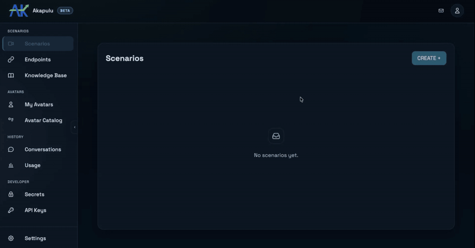

# Simple Assistant

This example is the fastest way to run an Akapulu scenario from the command line.

`simple-assistant.py` starts a conversation session, polls setup updates, and prints a ready-to-open Daily call URL. It is intentionally minimal so you can quickly validate your scenario setup before building a full custom UI.
Under the hood, Akapulu uses [Daily](https://docs.daily.co) for WebRTC, so the link you open connects you directly to the daily call.

## Prerequisite: Create a Scenario

Before running this example, create a scenario in the Akapulu web app:

1. Go to [akapulu.com/scenarios](https://akapulu.com/scenarios) and click `Create+`.
   - This opens the scenario builder where you define the assistant behavior and flow.
2. Enter any scenario name, such as `Simple Assistant`.
   - The scenario name is your internal label for identifying this configuration later.
3. Open the `Nodes` tab and click `+ Add Node` in the lower-right corner.
   - Nodes are the building blocks of your conversation flow.
   - For this simple assistant example, create just one node so setup stays easy and fast.
4. In the new node:
   - Enter any node name, such as `Greeting`.
5. Define the role and task messages:
   - Role message (node-level persona): the assistant's persistent behavior and tone.
   - Task message (node-level objective): what the assistant should accomplish in that node.
   - Role message example:

```text
You are an Akapulu solutions consultant.
```

   - Task message example:

```text
Akapulu overview:

Akapulu is a platform for building conversational video interfaces with lifelike avatar conversations in real time. Builders can create branching conversation flows, pass runtime variables at connect time, add RAG knowledge bases, call external APIs with HTTP endpoint tools, and use vision tools to analyze image input.

How to run this conversation:

Act as a friendly solutions consultant. Ask short discovery questions to understand what the user wants to build, who it is for, and what integrations they need. Give practical guidance on which Akapulu features fit their use case. Keep responses conversational and concise.
```

You can also paste the full node config directly: in the `Nodes` tab, click the `JSON` toggle in the top-right of the canvas, then paste this:

```json
{
  "nodes": {
    "Greeting": {
      "role_messages": [
        {
          "role": "system",
          "content": "You are an Akapulu solutions consultant."
        }
      ],
      "task_messages": [
        {
          "role": "system",
          "content": "Akapulu overview:\n\nAkapulu is a platform for building conversational video interfaces with lifelike avatar conversations in real time. Builders can create branching conversation flows, pass runtime variables at connect time, add RAG knowledge bases, call external APIs with HTTP endpoint tools, and use vision tools to analyze image input.\n\nHow to run this conversation:\n\nAct as a friendly solutions consultant. Ask short discovery questions to understand what the user wants to build, who it is for, and what integrations they need. Give practical guidance on which Akapulu features fit their use case. Keep responses conversational and concise."
        }
      ],
      "respond_immediately": true
    }
  },
  "initial_node": "Greeting"
}
```

6. Click `Save` and copy the scenario ID.
   - Copy the value shown right below `Scenario details`.
   - The scenario ID is the UUID used by API clients (like this simple assistant script) to start conversations with this scenario.

GIF showing how to create the scenario:



## What `simple-assistant.py` Does

`simple-assistant.py` is a minimal CLI example that:

1. Calls the Akapulu [`connect` API](https://docs.akapulu.com/api-reference/conversations/connect) with your scenario ID and avatar ID.
2. Polls conversation setup updates until the bot is ready.
3. Prints a tokenized Daily call URL you can open directly.

It is designed to be a quick sanity check for scenario setup and end-to-end connectivity.

## Run the Simple Assistant

1. Create an API key:
   - Go to [akapulu.com/api-keys](https://akapulu.com/api-keys).
   - Click `Create API key`.
   - Enter a description and click `Create API Key`
   - Copy the actual API key value.
2. Export your API key:

```bash
export AKAPULU_API_KEY="your_api_key_here"
```

3. If you have not cloned the examples repo yet, clone it:

```bash
git clone https://github.com/Akapulu/akapulu-examples.git && cd akapulu-examples/examples/fundamentals/simple-assistant
```

4. Run the script with your scenario ID (uses the default avatar ID):

   - Replace `"your-scenario-id"` with your actual scenario ID.

```bash
python3 simple-assistant.py --scenario-id "your-scenario-id"
```

5. Optional: run with a different avatar ID:

```bash
python3 simple-assistant.py --scenario-id "your-scenario-id" --avatar-id "your-new-avatar-id"
```

When setup completes, the script prints `Daily call URL`. Open that URL to join the call.

## Demo: Running the Simple Assistant

This GIF is a demo of the process of running the simple assistant, shown at 2x speed.


## Important: Direct Daily URL Limitations

Using the direct Daily URL is useful for quick testing, but it is not recommended for actual user facing applications.

With a direct Daily URL, you cannot reliably:

- control recording behavior from your own app flow
- customize the call UI and controls
- show node/stage transitions in your interface
- render transcripts in your app UI
- surface tool call activity and related debug context

For real integrations, use the custom UI example instead:

- [`examples/examples/fundamentals/custom-rtvi-ui`](../custom-rtvi-ui)
